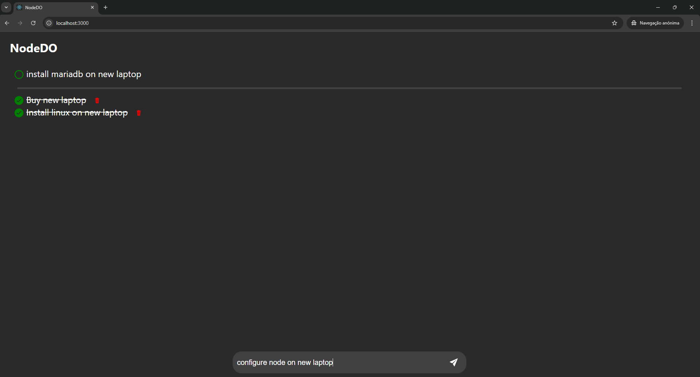

# NodeDO
* Node
* Yarn
* React
* MariaDB

## Screen Shots


## Backend
```
cd backend
```
### Exec
#### Install
```
yarn install
```
#### Run
```
yarn start
```

## Frontend
```
cd frontend
```
### Exec
#### Install
```
yarn install
```
#### Run
```
yarn start
```

