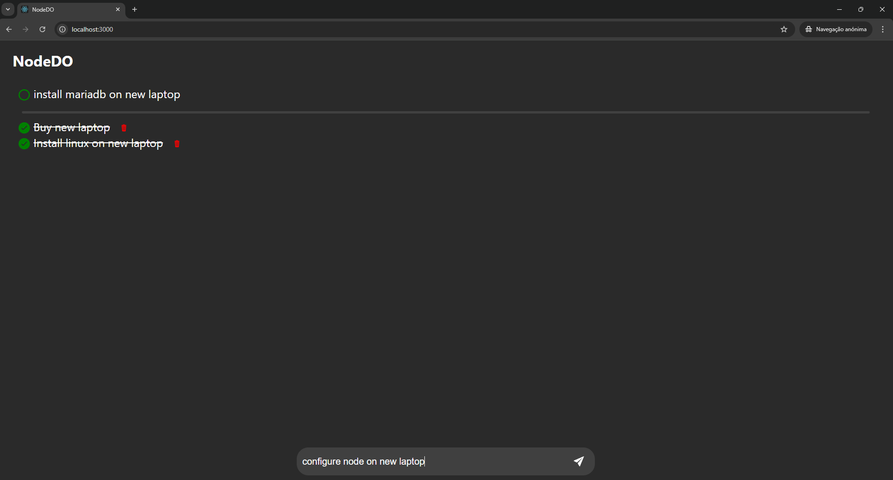

# ✅ NodeDO

**NodeDO** is a straightforward yet powerful task management app crafted with love and simplicity in mind. Built using Node.js, React, and MongoDB, this app lets you easily manage daily tasks with a clean and intuitive interface.

---

## 🚀 Features

- ✅ **Add tasks** easily
- ✅ **Mark tasks as done/undone**
- ✅ **Delete tasks** effortlessly
- 🚧 **Planned Features:**
  - Task notebooks for organization
  - Shared tasks with collaborators
  - Shared task notebooks

---

## 🛠️ Tech Stack

- **Frontend:** React
- **Backend:** Node.js (Express)
- **Database:** MongoDB
- **Package Manager:** Yarn

---

## 📸 Screenshot



---

## ⚙️ Installation and Usage

### Backend Setup

Navigate to the backend directory:
```bash
cd backend
```

Install dependencies:
```bash
yarn install
```

Run the backend server:
```bash
yarn start
```

### Frontend Setup

Navigate to the frontend directory:
```bash
cd frontend
```

Install dependencies:
```bash
yarn install
```

Run the frontend server:
```bash
yarn start
```

Your frontend will be available at [http://localhost:3000](http://localhost:3000).

---

## 📈 Future Enhancements

- Task categorization
- Real-time collaborative features
- Improved UI/UX

---

## 🤝 Contributing

Contributions from the heart are always welcome:

1. Fork the repository
2. Create a new branch (`git checkout -b feature/new-feature`)
3. Commit your enhancements (`git commit -m 'Add new-feature'`)
4. Push changes (`git push origin feature/new-feature`)
5. Submit a Pull Request

---

## 📄 License

Licensed under the **MIT License**.

---

## 👤 Author
**Gustavo Falcão**  
[GitHub @gustavofalcao1](https://github.com/gustavofalcao1)  
[Project Repository](https://github.com/gustavofalcao1/NodeDO)

---

